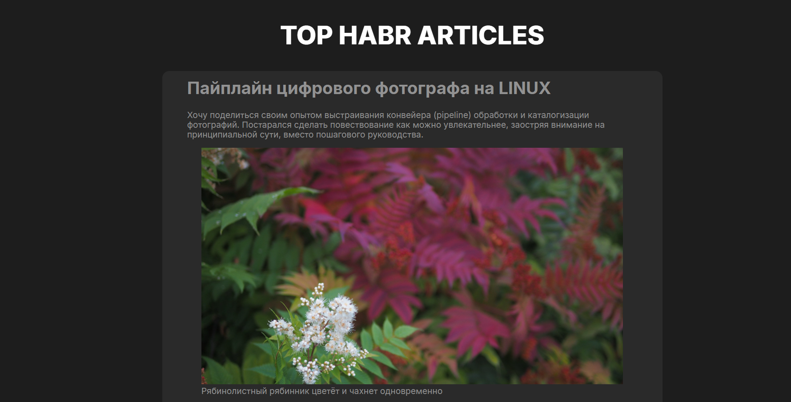

# 📰 Habr Parser


**Habr Parser** — это веб-сервис, который парсит лучшие статьи с [Habr](https://habr.com) и отображает их в виде списка с заголовком, текстом, количеством просмотров и ссылкой на оригинальную публикацию.

---

## ⚙️ Основная функциональность

- 🔍 Парсинг популярных статей с Habr  
- 💾 Обработка и возврат данных через API на FastAPI  
- 🖥️ Отображение статей на фронтенде с помощью JavaScript  
- 🔗 Для каждой статьи показывается:
  - название  
  - количество просмотров  
  - ссылка на оригинал  

---

## 🧩 Технологии

**Backend (Python / FastAPI):**
- `fastapi` — REST API
- `httpx`, `beautifulsoup4`, `lxml` — парсинг страниц
- `pydantic` — схемы данных
- `uvicorn` — сервер
- `python-dotenv` — переменные окружения

**Frontend (JavaScript):**
- Vanilla JS  
- Webpack + Babel  
- CSS-модули  

---

## 📁 Структура проекта

```
HABR-PARSER/
├── backend/                    # Серверная часть
│   ├── app/
│   │   ├── api/                # Маршруты API
│   │   ├── core/               # Настройки и конфигурации
│   │   ├── models/             # Модели данных
│   │   ├── schemas/            # Pydantic-схемы
│   │   ├── services/           # Логика парсинга и работы с Habr
│   │   └── web/                # Utils (сериализатор)
│   ├── requirements.txt        # Python-зависимости
│   └── venv/                   # Виртуальное окружение
│
├── frontend/                   # Клиентская часть
│   ├── src/
│   │   ├── components/         # UI-компоненты
│   │   ├── images/             # Изображения
│   │   ├── pages/              # Страницы
│   │   ├── scripts/            # Скрипты
│   │   └── vendor/             # Внешние зависимости
│   ├── dist/                   # Сборка
│   ├── node_modules/           # npm-зависимости
│   ├── index.html              # Точка входа
│   ├── package.json            # Конфигурация npm
│   ├── webpack.config.js       # Настройки сборки
│   └── babel.config.js         # Конфигурация Babel
│
├── .gitignore
├── LICENSE
└── README.md
```
---




---

## 🧱 Установка и запуск

### 🔹 Backend

```bash
cd backend
python -m venv venv
source venv/bin/activate   # или venv\Scripts\activate для Windows
pip install -r requirements.txt
python main.py
```

API будет доступно по адресу:  
👉 **http://127.0.0.1:8080/api/top_habr**

### 🔹 Frontend

```bash
cd frontend
npm install
npm run build
npm start
```

Фронтенд обращается к API, получает JSON с данными статей и отображает их на странице.

---

